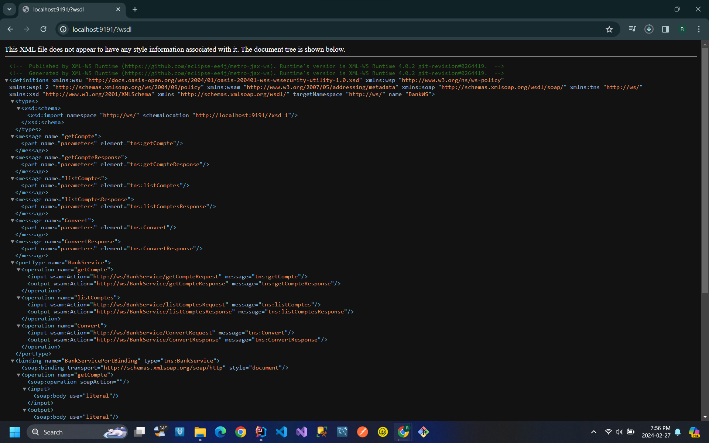

<h2>Compte rendu</h2>
<h4>Développement du Web Service SOAP:</h4>

Le développement du web service a été réalisé en utilisant Java et JaxWS, une API Java pour la création de services web SOAP. Trois opérations ont été implémentées :

<ol>
<li><strong>Convertir un Montant de l'Euro en DH :</strong> 
Cette fonctionnalité permet à l'utilisateur de spécifier un 
montant en euros et de le convertir en dirhams marocains en 
utilisant un taux de change fix.
 
</li>
<li><strong>Consulter un Compte :</strong> 
Cette fonctionnalité permet à l'utilisateur de consulter les 
détails d'un compte spécifique en fournissant son identifiant 
unique.
 
</li>
<li><strong>Consulter une Liste de Comptes :</strong> Cette fonctionnalité renvoie une liste de tous les comptes disponibles, avec leurs détails associés.
 

</li>
</ol>
<h4>Déploiement avec un Serveur JaxWS :</h4>
    
Le web service a été déployé en utilisant un serveur JaxWS, qui fournit une infrastructure pour héberger et exécuter des services web basés sur Java. Cela permet aux utilisateurs d'accéder aux fonctionnalités du service via des requêtes HTTP.

 <h4>Analyse du WSDL :</h4>
    
Le WSDL (Web Services Description Language) du service a été analysé en utilisant un navigateur HTTP. Le WSDL fournit une description complète des fonctionnalités offertes par le service, ainsi que les types de données et les opérations disponibles.

